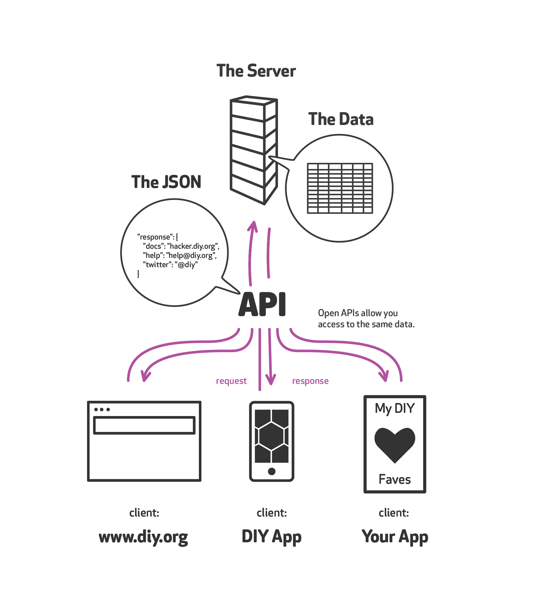

# What is an API?

### Objectives
*After this lesson, students will be able to:*

- Understand what an API is and how to use it
- Test an API using Postman or Insomnia
- Understand the difference between an API and a web application

### Preparation
*Before this lesson, students should already be able to:*

- Must understand what JSON is
- Should be able to make an MVC app

## Intro to Express APIs - Intro (20 mins)

### HTTP Refresher

*Draw on board*

Let's have a think about the HTTP request/response cycle. We should be reasonably familiar with the idea now. 

A client makes a request which is received by the web-server, the HTTP request is handled, routed, the relevant data from the database is received and a response is sent back to the client.

So far, this response has been a HTTP status and then some `text/html` after a template has been rendered by the templating engine. 

However, let's have a think about **content types**.

The problem about `text/html` is that it is designed for humans to understand.

**What if we wanted to request some data from a website across the internet and then do something programmatical with that data?**

We'd have to still make a HTTP request to get the data from our web-server the same - this is how the internet works! However, we might want the response to be in a format that is slightly easier for a computer to understand!

`text/html` is just one type of data that can be sent and received on the internet. Another common one is `application/json`. 

#### Definition of JSON

> **JSON** (JavaScript Object Notation) is a lightweight data-interchange format. It is easy for humans to read and write. It is easy for machines to parse and generate. It is based on a subset of the JavaScript Programming Language, Standard ECMA-262 3rd Edition - December 1999. 

JSON is just one format that we can send and receive over the internet. There are some others like XML that you might see. However, JSON is the most common and the easiest to use. 

#### API (Application Programming Interface)

In computer science API [application programming interface](https://en.wikipedia.org/wiki/Application_programming_interface) is quite a broad term. 

> **API** (application program interface) is a set of routines, protocols, and tools for building software applications. The API specifies how software components should interact and APIs are used when programming graphical user interface (GUI) components.

This term can be quite confusing as it is SO broad.

#### Web API 

However, when we think about APIs within the context of web application development we can simply think about it as a website that returns JSON instead of HTML so that a computer can use the data to do something instead of a human.

It allows a programme to interface with a website over the internet so that it can use that websites' data.

*Show this image on the board*

### Why do you need an API?

Nowadays, there are lots of different reasons why you would need an API [application programming interface](https://en.wikipedia.org/wiki/Application_programming_interface) for your website or tech project.

1. You might want to provide data to an IOS/Android app?
2. You might want to allow other developers to use your data? 
3. You might want to split up your codebase into a number of smaller services so that it is easier to manage
4. You might want to use a front-end framework to serve your data like Angular, Backbone or Ember

These are just a few of the reasons. It's now very difficult to be a developer and not have to either work on or use an API. 

### Building an API

There are a number of different frameworks that you could use when making an API for your project.

1. **Sinatra** (Stripped back codebase)
2. **Rails** (very quick to setup)
3. **Express** (Used a lot with the MEAN stack)
4. **Sails** (A JS Rails, still in development)

There are quite a few others! PHP is still used a lot as is Python.

## RESTful APIs - Intro (10 mins)

By definition, an API shouldn't be RESTful. This might be confusing at the moment but one of the reasons is that if you are just accessing data you don't need to cater for NEW and an EDIT actions - you just send the data directly to CREATE and UPDATE.

As we build more APIs, this will become clearer.

However, you will see that website have a RESTful (REST) api.

- [Twitter](https://dev.twitter.com/rest/public)
- [Soundcloud](https://developers.soundcloud.com/docs/api/reference)

Some helpful people have also built fake APIs to play with:

- [ReqRes](http://reqres.in/)
- [JSONPlaceHolder](http://jsonplaceholder.typicode.com/)

## Conclusion (5 mins)

I'm guessing everyone is really looking forward to building an API so that we can consume our own API. Let's do that next!

- What is JSON
- Why do we need APIs
